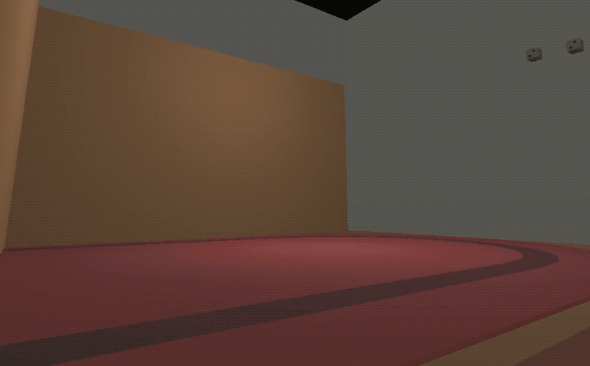

# dice-rollerz
**by Balraj Basi**

*Come test your luck in Dice Rollerz. How many rolls will you go before hitting those dreaded doubles?*

 
 

## Setup / Notes
 - Built with [Unity LTS 2018.4.12f1](https://unity3d.com/get-unity/download/archive)

- Intended for Portrait display ( 9:16 ). For best results, create a 9x16 aspect ratio within the Game View.

- In order to boot the game, first launch the **'ui'** scene and then hit play. Alternatively, use the Scene Autoload tool to select the **'ui'** as the master scene, thus automatically switching to it upon subsequent presses of the play button.

- Toggling the **debug** checkbox in game will result in the fifth roll afterwards having a result of both die landing on 1.

 
 

## Implementation

### Dice
Dice are implemented using 3D Physics & Forces. \
Over the course of a roll, 3 different forces are applied to each die.

1. Initial
2. Collision 1 - Table
3. Collision 2 - Wall | Other Die

 

### Dice - Side Up Detection
After the second collision, each die waits until its velocity reaches zero. \
At this point, the die determines which side is up by 
iterating child transforms ( which have been placed accordingly ) and performing a y position test to see which transform is the highest.

 

### Dice - Rigged Result ( 1 / 1 )
After the second collision, rigged die have their angular velocity set to zero, resulting in no rotation. \
Their rotation is then tweened ensuring that the 1 side is facing up.

 
 

### Scenes
Scene | Notes
------------ | -------------
ui | UI elements & boot sequence 
game | 3D assets & camera

 

### Scripts
Folder | Script
------------ | -------------
Core | Camera_.cs 
Core | Game.cs 
Core | GameState.cs 
Core | glbl.cs 
Core | IO.cs 
Core | SFX.cs 
Core | UI.cs 
Game | Die.cs 
Game | Fan.cs 
UI | Screen.cs 
UI | Screen_Game.cs 
UI | Screen_Home.cs 
UI | Screen_Over.cs 

 
 

## Assets
Asset | Type
------------ | -------------
[Unity LTS 2018.4.12f1](https://unity.com/) | Game Engine
[Fork](https://git-fork.com/) | Git Client
[Visual Studio Community 2017 for Mac](https://visualstudio.microsoft.com/vs/mac/) | IDE
[Audacity](https://www.audacityteam.org/) | Audio Editor
[TextMesh Pro](https://docs.unity3d.com/Manual/com.unity.textmeshpro.html) | Plugin
[DoTween](https://assetstore.unity.com/packages/tools/animation/dotween-hotween-v2-27676) | Plugin
[Scene Auto Loader](https://wiki.unity3d.com/index.php/SceneAutoLoader) | Editor Tool
[Dice : Jarst - Board Games ](https://assetstore.unity.com/packages/3d/props/interior/board-games-145799)| 3D Model
[Furniture : Kenny - Furniture Kit](https://www.kenney.nl/assets/furniture-kit)| 3D Models
[SmallType Writing](https://www.dafont.com/smalltypewriting-medium.font)| Font
[Ceiling Fan (Indoor)](https://freesound.org/people/embracetheart/sounds/345230/)| SFX / Ambience
[Room Tone Apartment](https://freesound.org/people/leonelmail/sounds/329568/)| SFX / Ambience
[Menu Click](https://freesound.org/people/Leszek_Szary/sounds/146721/)| SFX
[2 Dice](https://freesound.org/people/ChineseWhite/sounds/167566/)| SFX
[Dice Sounds](https://freesound.org/people/2BACH/sounds/185964/)| SFX
[Powerup / Success](https://freesound.org/people/GabrielAraujo/sounds/242501/)| SFX
[Wrong](https://freesound.org/people/Raclure/sounds/483598/)| SFX